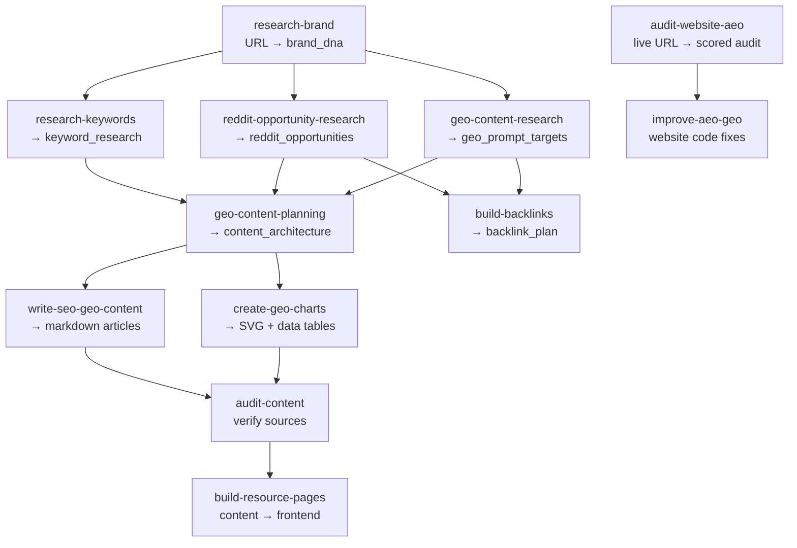

# GTM Engineer Skills

A collection of agent skills for go-to-market engineering — research, content, SEO, GEO, and frontend implementation. The repo is meant to work for both Codex and Claude Code.

---

## Workflow

Skills are designed to run in sequence. Each step produces files that feed into the next.



### Step by step

| Step | Skill                             | Input                                               | Output                                                                |
| ---- | --------------------------------- | --------------------------------------------------- | --------------------------------------------------------------------- |
| 1    | **`research-brand`**              | Company URL                                         | `brand_dna.md` — positioning, audience, competitors, voice            |
| 2a   | **`research-keywords`**           | Brand DNA + product category                        | `keyword_research.md` — prioritized keywords by intent                |
| 2b   | **`reddit-opportunity-research`** | Brand DNA + optional keyword/GEO files              | `reddit_opportunities.md` — ranked subreddit and thread opportunities |
| 2c   | **`geo-content-research`**        | Brand DNA + product category                        | `geo_prompt_targets.md` — AI prompts by business-value tier           |
| 3    | **`geo-content-planning`**        | Brand DNA + keywords + GEO prompts + Reddit signals | `content_architecture.md` — page plan with types, URLs, priority      |
| 4a   | **`write-seo-geo-content`**       | Content architecture + research                     | Markdown articles with frontmatter                                    |
| 4b   | **`create-geo-charts`**           | Data from articles                                  | SVG charts + HTML tables + JSON-LD                                    |
| 5    | **`audit-content`**               | Articles + Brand DNA                                | Audit reports — verified URLs, stats, claims                          |
| 6a   | **`build-resource-pages`**        | Audited content + client codebase                   | Frontend resource center pages                                        |
| 6b   | **`audit-website-aeo`**           | Live website URL                                    | `aeo_audit_report.md` — scored AEO/GEO audit with prioritized fixes   |
| 6c   | **`improve-aeo-geo`**             | Client website codebase + audit report              | Code fixes for AI discoverability                                     |

Steps marked **a/b/c** can run in parallel.

## Installation

Clone the repo once, then make whichever skill folders you want available to Codex or Claude Code.

```bash
git clone https://github.com/onvoyage-ai/gtm-engineer-skills.git
cd gtm-engineer-skills
```

Each skill lives in its own folder and uses a `SKILL.md` file, which matches the shared agent-skills pattern used across both tools.

### Codex

Symlink or copy the desired skill folders into `~/.codex/skills/` (or `$CODEX_HOME/skills/` if you use a custom Codex home).

```bash
mkdir -p ~/.codex/skills
ln -s "$PWD/research-brand" ~/.codex/skills/research-brand
ln -s "$PWD/reddit-opportunity-research" ~/.codex/skills/reddit-opportunity-research
```

### Claude Code

Symlink or copy the desired skill folders into `~/.claude/skills/` or a project-local `.claude/skills/` directory.

```bash
mkdir -p ~/.claude/skills
ln -s "$PWD/research-brand" ~/.claude/skills/research-brand
ln -s "$PWD/reddit-opportunity-research" ~/.claude/skills/reddit-opportunity-research
```

## Platform Note

The `reddit-opportunity-research` workflow is useful in either tool, but the exact Reddit access experience differs by product. ChatGPT already has native Reddit access in-product; Claude generally does not, so keep that in mind when comparing outputs.

---

## Skills

### [Research Brand DNA](research-brand/)

Researches a company from its URL and produces a Brand DNA file covering positioning, audience, competitors, voice, and messaging.

Folder: `research-brand/`

### [Research SEO/GEO Keywords](research-keywords/)

Finds high-value SEO and GEO keywords using web search, AI analysis, and optionally paid tools like Ahrefs or Semrush.

Folder: `research-keywords/`

### [Reddit Opportunity Research](reddit-opportunity-research/)

Finds Reddit pain-point discussions, target subreddits, and search-language patterns based on Brand DNA. Produces a ranked opportunity list for helpful promotion, content seeding, and prompt research.

Folder: `reddit-opportunity-research/`

### [GEO Content Research](geo-content-research/)

Researches what prompts people ask AI engines about a product category. Produces a GEO prompt target table with business-value tiers (Buy/Solve/Learn).

Folder: `geo-content-research/`

### [GEO Content Planning](geo-content-planning/)

Reads brand DNA, keyword research, and GEO prompt targets, then produces a content architecture — what pages to create, their types, URLs, and priority.

Folder: `geo-content-planning/`

### [Write SEO + GEO Content](write-seo-geo-content/)

Writes product-led content pages optimized for search engines and AI engine citations. Research-first methodology with page-type frameworks and no fabricated stats.

Folder: `write-seo-geo-content/`

### [Create GEO/SEO Charts](create-geo-charts/)

Creates data visualizations that AI engines can parse, quote, and cite. Every chart includes a text summary, HTML data table, and JSON-LD.

Folder: `create-geo-charts/`

### [Audit Content](audit-content/)

Verifies truthfulness, accuracy, and link integrity of content before publishing. Catches fabricated statistics, dead URLs, and misattributed sources.

Folder: `audit-content/`

### [Build Resource Pages](build-resource-pages/)

Takes existing content markdown files and builds production-ready resource center pages on client websites using their existing tech stack and design system.

Folder: `build-resource-pages/`

### [Audit Website AEO/GEO](audit-website-aeo/)

Crawls a live website, runs 16 deterministic checks plus a 6-dimension content evaluation, and produces a scored A-F audit report with prioritized fixes. Run it to get a baseline before `improve-aeo-geo`, and again afterward to measure the delta. Includes a zero-dependency Node crawler script.

Folder: `audit-website-aeo/`

### [Improve Website AEO/GEO](improve-aeo-geo/)

Audits a website codebase and makes code changes so AI engines can better discover, parse, quote, and cite the site.

Folder: `improve-aeo-geo/`

**Check your score first**: run `audit-website-aeo` for a local audit, or use the hosted [aeo-audit.sh](https://aeo-audit.sh/).

---

## Contributing

See [CONTRIBUTING.md](CONTRIBUTING.md) for how to contribute new skills, improve existing ones, or add examples.

## Automated Evals

The repo now includes an initial offline eval harness in [evals/](evals/). It currently covers:

- strict CSV contract validation for `research-keywords`, `geo-content-research`, and `geo-content-planning`
- deterministic regression testing for `audit-website-aeo/scripts/aeo-audit.mjs`

Run it with:

```bash
npm run test:evals
```

## License

MIT — see [LICENSE](LICENSE).
